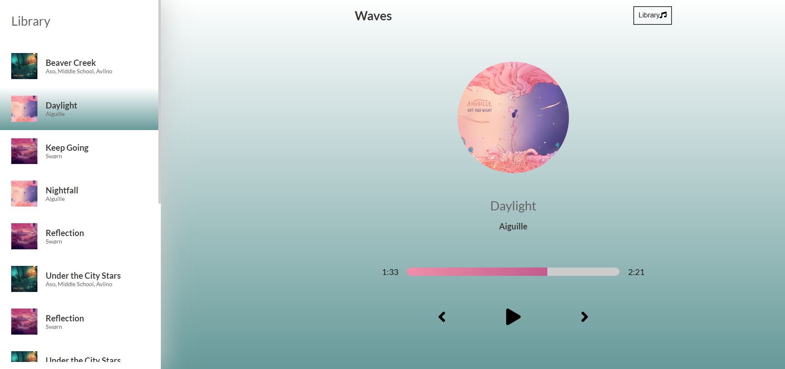

# MusicApp

This app powered by [Create React App](https://github.com/facebook/create-react-app) and was created to play your favorite music. 

 

## Motivation

I started this project to get some more practice in creating and managing state in React. 

## How to Use

Application opens at the first song from the list. Click **Library** button to open a list of available songs on the left side of the screen.

You can choose any song you like from the list - once chosen it will be highlighted with green color. The song's album will appear on the main screen together with it's title and band's name. The song's length will appear on the right side of the bar.

Once clicked **Play** button the song will start playing. The remaining time will decrease as the song progresses. You can scroll on the bar to back and forward in the song. The bar will also imitate the color of the album's main color.

You also have an option to go the teh previous or next song by clicking on the certain **icons**. 

See live at: 

## Built with

- [Create React App](https://github.com/facebook/create-react-app) - JavaScript Framework
- [Sass](https://github.com/sass/sass) - An extension of CSS
- [Fort Awesome](https://fortawesome.com/) - The iconic SVG, font, and CSS toolkit
- [UUID](https://www.npmjs.com/package/uuid) - Library for generating universally unique identifiers

## License

This project is licensed under the MIT License - see the [LICENSE](LICENSE) file for details.
